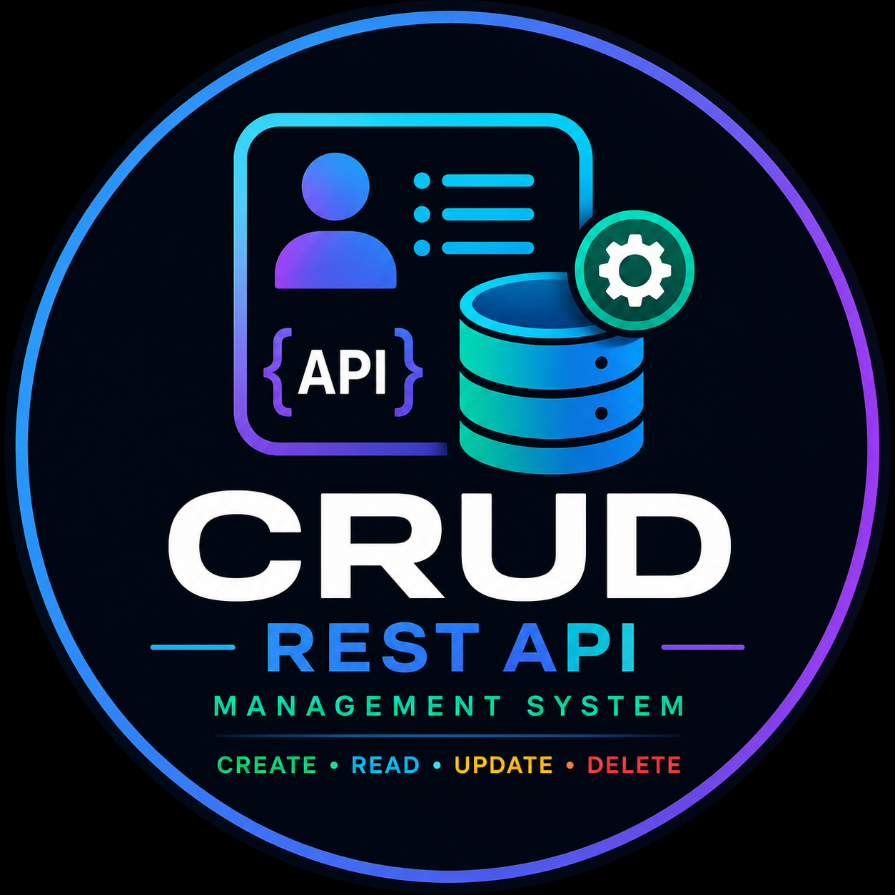
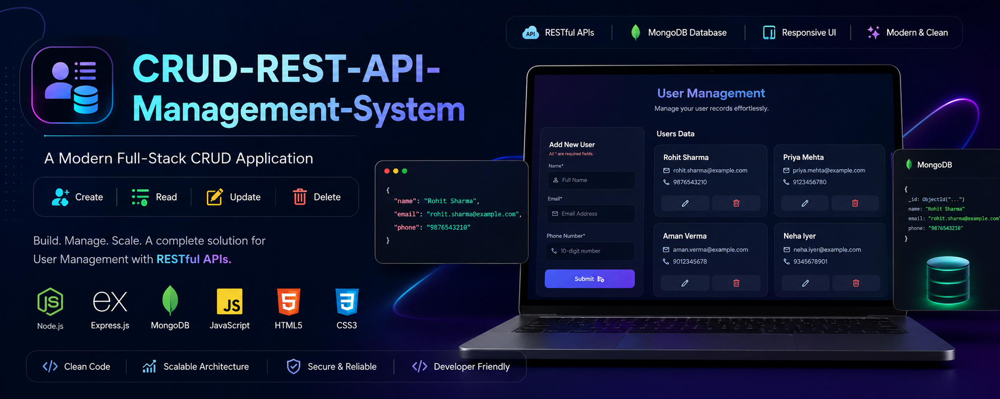
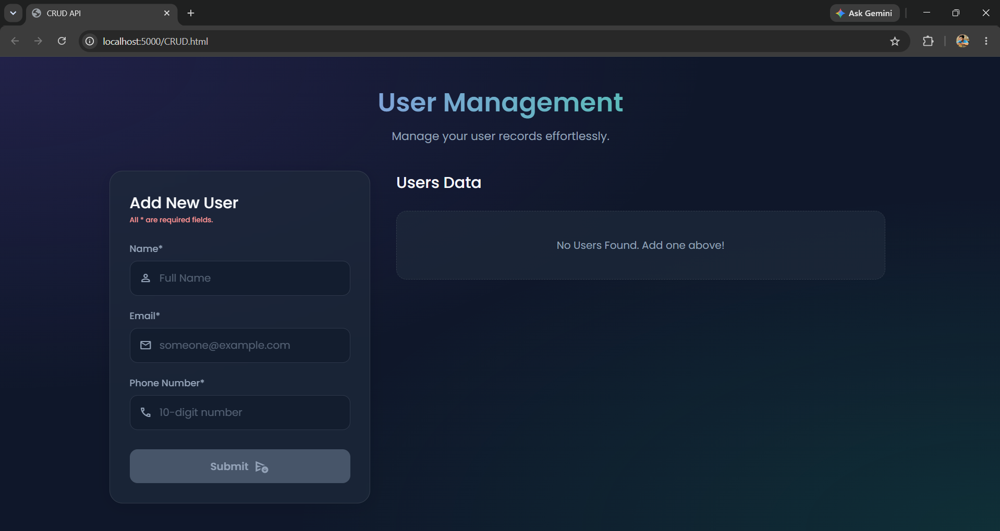
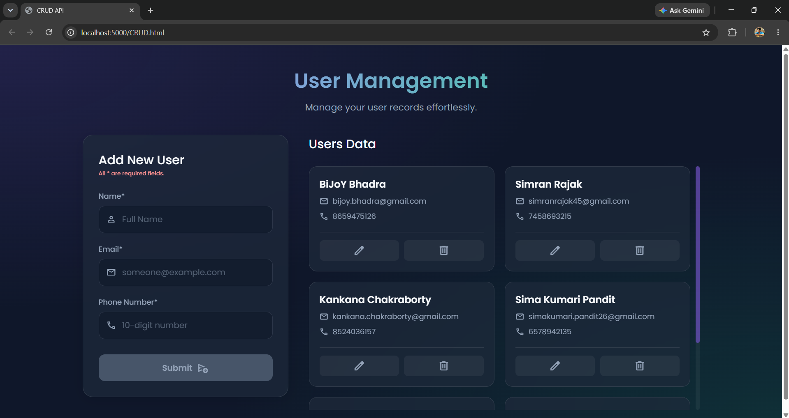
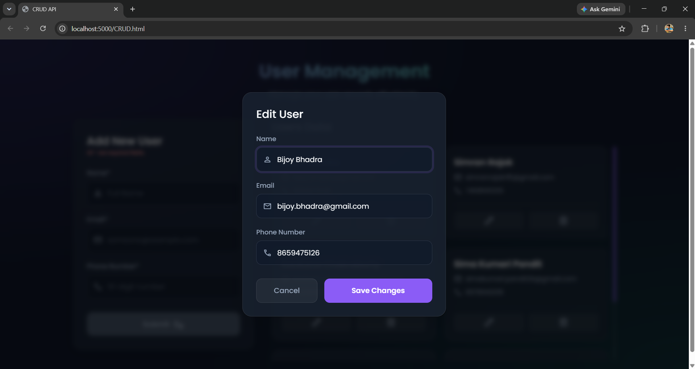
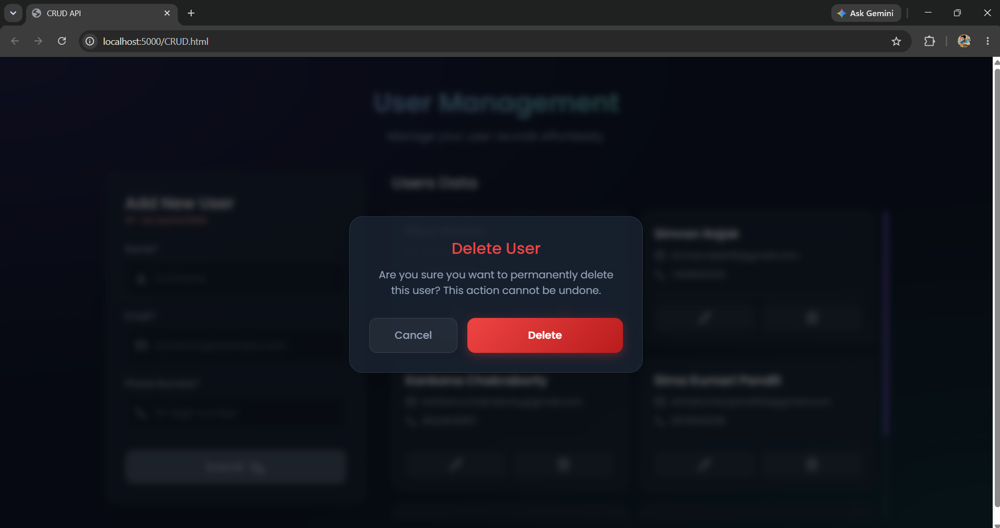
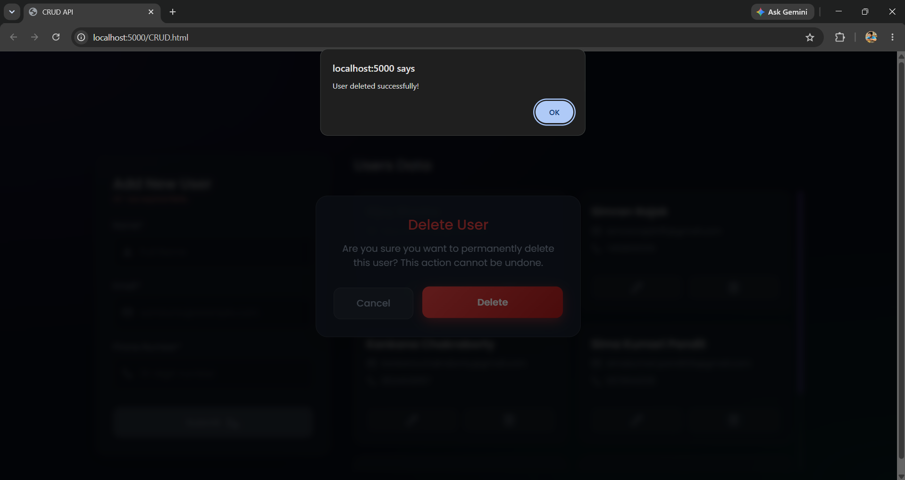
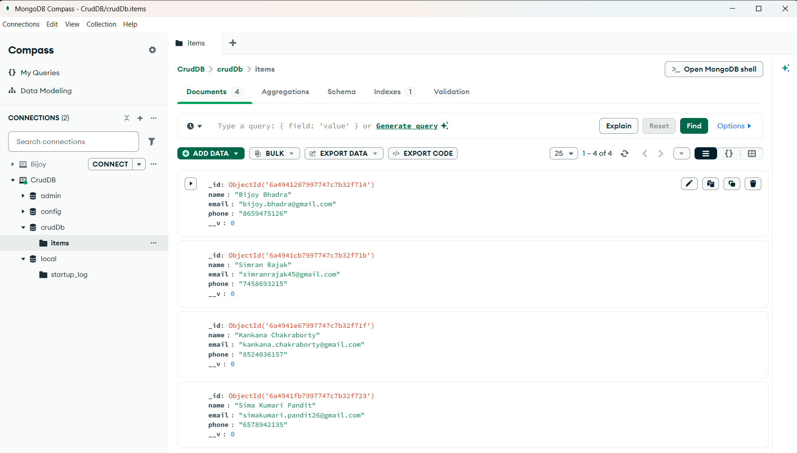

<div align="center">
<h1 align="center">

 CRUD REST API Management System
<p> A Modern Full-Stack User Management Application using REST APIs</p>

</h1>
</div>

</p>



<br>

<p align="center">
  A responsive CRUD (Create, Read, Update, Delete) web application built with
  <strong>Node.js</strong>, <strong>Express.js</strong>, <strong>MongoDB</strong>,
  <strong>HTML</strong>, <strong>CSS</strong>, and <strong>JavaScript</strong>.
  It demonstrates complete RESTful API integration with a clean, modern user interface.

<p align="center">


</p>

<p align="center">


</p>

</div>

---

# 📖 Table of Contents

- [Project Overview](#-project-overview)
- [Key Features](#-key-features)
- [Technology Stack](#-technology-stack)
- [Project Architecture](#-project-architecture)
- [Project Structure](#-project-structure)
- [Application Screenshots](#-application-screenshots)
- [REST API Endpoints](#-rest-api-endpoints)
- [Getting Started](#-getting-started)
- [Installation](#-installation)
- [Running the Application](#-running-the-application)
- [Future Enhancements](#-future-enhancements)
- [Author](#-author)
- [License](#-license)

---

# 📌 Project Overview

CRUD REST API Management System is a full-stack web application that demonstrates how a frontend interface communicates with a backend server through RESTful APIs to perform Create, Read, Update, and Delete (CRUD) operations on user data stored in MongoDB.

The application is designed with a modern dark-themed interface, responsive layout, and intuitive user experience. Users can seamlessly add, view, edit, and delete records without refreshing the page, showcasing asynchronous communication using the Fetch API.

This project serves as a practical example of full-stack web development by integrating frontend technologies with an Express.js backend and MongoDB database through Mongoose.

---

# ✨ Key Features

- ✅ Create new users
- ✅ Display all users dynamically
- ✅ Update existing user records
- ✅ Delete users with confirmation dialog
- ✅ RESTful API architecture
- ✅ MongoDB database integration
- ✅ Express.js backend server
- ✅ Client-side form validation
- ✅ Responsive user interface
- ✅ Modern dark-themed design
- ✅ Dynamic DOM rendering
- ✅ Fetch API integration
- ✅ Modular frontend and backend structure
- ✅ Real-time CRUD operations
- ✅ Clean and beginner-friendly codebase

---

# 🛠 Technology Stack

| Category | Technologies |
|-----------|--------------|
| Frontend | HTML5, CSS3, JavaScript |
| Backend | Node.js, Express.js |
| Database | MongoDB, Mongoose |
| Communication | REST API, Fetch API |
| Development Tools | MongoDB Compass, npm, Git, GitHub |
| Runtime Environment | Node.js |

---
# 🏗 Project Architecture

The application follows a traditional three-tier architecture where the frontend communicates with the backend through RESTful APIs, and the backend interacts with the MongoDB database.

```text
                     ┌──────────────────────────┐
                     │          User            │
                     └────────────┬─────────────┘
                                  │
                                  ▼
                 ┌────────────────────────────────┐
                 │         Frontend (UI)          │
                 │                                │
                 │  HTML • CSS • JavaScript       │
                 │        Fetch API               │
                 └────────────┬───────────────────┘
                              │
                     HTTP REST Requests
                              │
                              ▼
                 ┌────────────────────────────────┐
                 │      Express.js REST API       │
                 │                                │
                 │        Node.js Backend         │
                 └────────────┬───────────────────┘
                              │
                        Mongoose ODM
                              │
                              ▼
                 ┌────────────────────────────────┐
                 │          MongoDB               │
                 │       User Collection          │
                 └────────────────────────────────┘
```

---

# 📂 Project Structure

```text
CRUD-REST-API-Management-System/
│
├── assets/
│   ├── banner.png
│   ├── logo.png
│   ├── home.png
│   ├── create-user.png
│   ├── update-user.png
│   ├── delete-confirmation.png
│   ├── delete-success.png
│   └── mongodb.png
│
├── backend/
│   ├── server.js
│   ├── package.json
│   └── package-lock.json
│
├── frontend/
│   ├── CRUD.html
│   ├── styles.css
│   └── script.js
│
├── .gitignore
├── LICENSE
└── README.md
```

---

# 📁 Directory Overview

| File / Folder | Description |
|---------------|-------------|
| **assets/** | Repository images including banner, logo, screenshots, and MongoDB preview. |
| **backend/server.js** | Express.js server, MongoDB connection, Mongoose schema, and REST API implementation. |
| **backend/package.json** | Project dependencies and npm scripts. |
| **backend/package-lock.json** | Automatically generated dependency lock file. |
| **frontend/CRUD.html** | Main user interface of the application. |
| **frontend/styles.css** | Styling for the responsive dark-themed UI. |
| **frontend/script.js** | Client-side JavaScript handling CRUD operations using Fetch API. |
| **.gitignore** | Specifies files and folders ignored by Git. |
| **LICENSE** | MIT License for the project. |
| **README.md** | Project documentation. |

---

# 🔄 Application Workflow

```text
Open Application
       │
       ▼
Load Existing Users
       │
       ▼
GET /api/items
       │
       ▼
Display User Cards
       │
 ┌─────┼──────────┐
 │     │          │
 ▼     ▼          ▼
Create Update   Delete
 │       │         │
 ▼       ▼         ▼
POST    PUT     DELETE
 │       │         │
 └───────┼─────────┘
         ▼
 Update MongoDB Database
         │
         ▼
 Refresh User Interface
```

---

# 🌐 REST API Request Flow

```text
Frontend
    │
    │  Fetch API
    ▼
Node.js + Express.js
    │
    │  Mongoose
    ▼
MongoDB
    │
    ▼
JSON Response
    │
    ▼
Frontend Updates UI
```

---

# 📸 Application Screenshots

## 🏠 Home Page

The landing interface displays the user registration form and dynamically loads all user records from MongoDB.

<p align="center">

</p>

---

## ➕ Create User

Users can add new records by entering their name, email address, and phone number. Client-side validation ensures that only valid data is submitted.

<p align="center">

</p>

---

## ✏️ Update User

The edit modal allows users to modify existing records without leaving the page. Updated information is saved instantly through the REST API.

<p align="center">

</p>

---

## 🗑 Delete Confirmation

Before removing a record, the application displays a confirmation dialog to prevent accidental deletion.

<p align="center">

</p>

---

## ✅ Delete Success

Once confirmed, the selected user is deleted from MongoDB and the interface updates immediately.

<p align="center">

</p>

---

## 🗄 MongoDB Database

All user records are stored in MongoDB using Mongoose. Each document contains the user's name, email, and phone number.

<p align="center">

</p>

---
# 🔗 REST API Endpoints

The backend exposes RESTful API endpoints for performing Create, Read, Update, and Delete (CRUD) operations on user records.

| HTTP Method | Endpoint | Description |
|-------------|----------|-------------|
| **GET** | `/api/items` | Retrieve all users from MongoDB |
| **POST** | `/api/items` | Create a new user |
| **PUT** | `/api/items/:id` | Update an existing user |
| **DELETE** | `/api/items/:id` | Delete a user |

---

# 📡 API Request Examples

## 1️⃣ Get All Users

### Request

```http
GET /api/items HTTP/1.1
Host: localhost:5000
```

### Response

```json
[
  {
    "_id": "6856b3c3d19b3d2d2c5e4b31",
    "name": "Aarav Sharma",
    "email": "aarav.sharma@example.com",
    "phone": "9876543210"
  },
  {
    "_id": "6856b3c3d19b3d2d2c5e4b32",
    "name": "Priya Verma",
    "email": "priya.verma@example.com",
    "phone": "9123456789"
  }
]
```

---

## 2️⃣ Create User

### Request

```http
POST /api/items HTTP/1.1
Content-Type: application/json
```

```json
{
  "name": "Rahul Sen",
  "email": "rahul.sen@example.com",
  "phone": "9988776655"
}
```

### Response

```json
{
  "_id": "6856b3c3d19b3d2d2c5e4b33",
  "name": "Rahul Sen",
  "email": "rahul.sen@example.com",
  "phone": "9988776655"
}
```

---

## 3️⃣ Update User

### Request

```http
PUT /api/items/6856b3c3d19b3d2d2c5e4b33
Content-Type: application/json
```

```json
{
  "name": "Rahul Kumar Sen",
  "email": "rahul.k.sen@example.com",
  "phone": "9876501234"
}
```

### Response

```json
{
  "_id": "6856b3c3d19b3d2d2c5e4b33",
  "name": "Rahul Kumar Sen",
  "email": "rahul.k.sen@example.com",
  "phone": "9876501234"
}
```

---

## 4️⃣ Delete User

### Request

```http
DELETE /api/items/6856b3c3d19b3d2d2c5e4b33
```

### Response

```json
{
  "message": "User deleted successfully."
}
```

---

# ⚙️ Getting Started

Follow these steps to set up and run the project on your local machine.

## Prerequisites

Ensure the following software is installed before running the application.

- Node.js (v18 or later recommended)
- npm (comes with Node.js)
- MongoDB Community Server
- MongoDB Compass (Optional)
- Git

---

# 📥 Clone the Repository

```bash
git clone https://github.com/Bijoy781999/CRUD-REST-API-Management-System.git
```

Move into the project directory.

```bash
cd CRUD-REST-API-Management-System
```

---

# 📦 Install Dependencies

Navigate to the backend directory.

```bash
cd backend
```

Install all required npm packages.

```bash
npm install
```

---

# ▶️ Start MongoDB

Make sure your local MongoDB service is running before starting the server.

Default connection used in this project:

```text
mongodb://localhost:27017/crudDb
```

---

# 🚀 Run the Backend Server

Inside the **backend** directory, start the Express server.

```bash
node server.js
```

If everything is configured correctly, you should see a message similar to:

```text
Server running on http://localhost:5000
Connected to MongoDB
```

---

# 🌐 Launch the Frontend

Open the **frontend** folder and launch:

```text
CRUD.html
```

You can:

- Double-click the file to open it in your browser, or
- Use the VS Code Live Server extension for a better development experience.

The frontend communicates with the backend using the Fetch API.

---

# 📦 Backend Dependencies

The project uses the following npm packages.

| Package | Purpose |
|----------|---------|
| Express.js | Backend web framework |
| Mongoose | MongoDB object modeling |
| CORS | Enable cross-origin requests |
| Dotenv* | Environment variable support (optional for future enhancements) |

> **Note:** The current project connects directly to the local MongoDB URI. `dotenv` can be used in future versions to move configuration values into environment variables.

---

# 💾 Database Configuration

The application stores all user records in MongoDB.

**Database Name**

```text
crudDb
```

**Collection**

```text
items
```

Each document contains:

```json
{
  "_id": "...",
  "name": "Aarav Sharma",
  "email": "aarav.sharma@example.com",
  "phone": "9876543210"
}
```

Mongoose automatically generates the unique `_id` for every document.

---
# ⭐ Project Highlights

- 🚀 Full-Stack CRUD (Create, Read, Update, Delete) Application
- 🌐 RESTful API architecture using Express.js
- 🗄️ MongoDB integration with Mongoose ODM
- 💻 Responsive and modern dark-themed user interface
- ⚡ Dynamic data rendering using the Fetch API
- ✏️ Update user information through a modal interface
- 🗑️ Delete confirmation dialog to prevent accidental data loss
- ✅ Client-side input validation for name, email, and phone number
- 🔄 Real-time synchronization between frontend and backend
- 📦 Clean project structure for easy understanding and maintenance

---

# 🎯 Learning Objectives

This project demonstrates the practical implementation of:

- REST API development with Express.js
- CRUD operations using MongoDB
- Database interaction with Mongoose
- Asynchronous JavaScript using the Fetch API
- Client-server communication
- Responsive web design with HTML and CSS
- Frontend form validation
- Dynamic DOM manipulation
- Full-stack web application development
- Version control using Git and GitHub

---

# 🚀 Future Enhancements

The following features can be added in future versions to make the application more production-ready.

- 🔐 User Authentication (JWT)
- 👤 Login & Registration System
- 🛡️ Role-Based Access Control (Admin/User)
- 🔍 Search Users
- 🎯 Filter & Sort Records
- 📄 Pagination Support
- 📷 User Profile Images
- 📤 CSV / Excel Export
- 📥 CSV Import
- 🌙 Light/Dark Theme Toggle
- 📱 Progressive Web App (PWA)
- 🐳 Docker Containerization
- ☁️ Cloud Deployment (Render / Railway / Vercel)
- 📚 Swagger/OpenAPI Documentation
- 🧪 Unit & Integration Testing
- 🔄 CI/CD with GitHub Actions

---

# 🤝 Contributing

Contributions are welcome!

If you'd like to improve this project, follow these steps:

1. Fork the repository.
2. Create a new feature branch.

```bash
git checkout -b feature/your-feature-name
```

3. Commit your changes.

```bash
git commit -m "Add new feature"
```

4. Push the branch.

```bash
git push origin feature/your-feature-name
```

5. Open a Pull Request.

---

# 👨‍💻 Author

<div align="center">

## Bijoy Bhadra

Computer Science Engineer

AI • Machine Learning • Deep Learning • Backend Development

</div>

---

# 📜 License

This project is licensed under the **MIT License**.

See the [LICENSE](LICENSE) file for complete details.

---

# 🙏 Acknowledgements

Special thanks to the open-source community and the developers behind the technologies that made this project possible.

- Node.js
- Express.js
- MongoDB
- Mongoose
- HTML5
- CSS3
- JavaScript
- Git
- GitHub

---

# 💖 Support

If you found this project useful or learned something from it, please consider giving it a ⭐ on GitHub.

Your support helps motivate future open-source development and encourages continuous improvement.

---

<div align="center">

## ⭐ Star this repository if you found it helpful!

Made with ❤️ by **Bijoy Bhadra**

</div>
